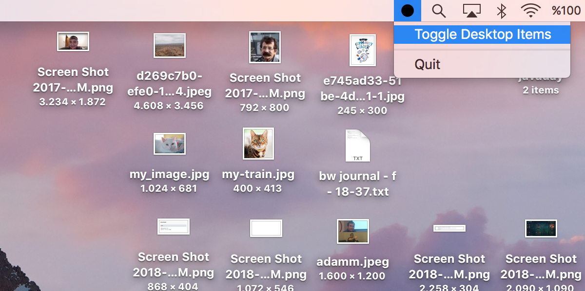
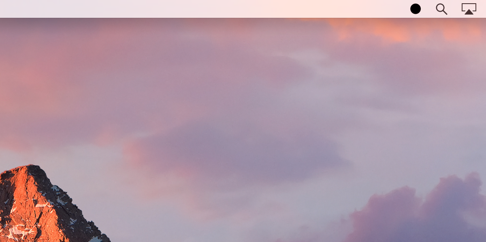

= Gapa

Gapa, a macOS utility, enables you to hide files and folders located on your desktop.

.Before hiding the items:

.After hiding the items:

== Creating a Standalone Gapa App

Do you want to use this tool? Ah cool!

Once you have the following prerequisites, you're good to go:

* python 3+
* py2app
* rumps

Run the command below:

----
$ cd gapa/
$ python setup.py py2app
----

You should see a folder, `dist` in the `gapa` folder. Copy and paste `gapa.app` to your `applications` folder.

Happy Gapaling..
